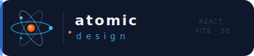

<div align="center">
  
</div>

<div align="center">
  <a href="./README.md">🇬🇧 English</a> ·
  <a href="./README.tr.md">🇹🇷 Türkçe</a>
</div>

<br/>

# React Atomic Design Demo

**Canlı Demo:** [react-atomic-design-demo.yasinates.com](https://react-atomic-design-demo.yasinates.com)

---

## Teknoloji Stack'i

| Katman | Teknoloji |
|---|---|
| UI Framework | React 18 + Vite |
| Component Workshop | Storybook 8 |
| Stil | Düz CSS + BEM |
| Unit Testler | Vitest + React Testing Library |
| Etkileşim Testleri | Storybook play fonksiyonları |
| Local Geliştirme | Docker + docker-compose |

---

## Local Kurulum

```bash
npm install
npm run dev        # http://localhost:5173
npm run storybook  # http://localhost:6006
npm run test:run   # tüm unit testleri çalıştır
```

## Docker ile Çalıştırma

```bash
docker compose up
# app       → http://localhost:5173
# storybook → http://localhost:6006
```

## Testler

```bash
npm run test:run   # Vitest unit testleri
npm run storybook  # Storybook interaction testleri (Interactions paneli)
```

---

## Makaleler

- 🇬🇧 [Atomic Design in Practice: React and Storybook from Scratch](https://dev.to/yasinatesim/atomic-design-in-practice-react-and-storybook-from-scratch-2gkh)
- 🇹🇷 [Atomic Design Prensibi (React ve Storybook Örnekleriyle)](https://medium.com/@yasinatesim/atomic-design-prensibi-react-ve-storybook-%C3%B6rnekleriyle-e43e50ca9807)

---

This README was generated by [markdown-manager](https://github.com/yasinatesim/markdown-manager) 🥲
